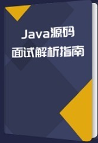

## 1 目标
致力于构建全球最完善的 Java 高并发理论体系。让我们的程序更加可靠，跳槽面试更轻松。

## 高并发方案概要

### 线程安全性
线程安全性，主要从原子性、可见性、有序性

### 安全发布对象
安全发布对象的一些核心方法，主要通过单例类的多种实现方式体会，这也是对线程安全性的巩固，也是把线程安全性涉及的一些关键字和类再一次放到实际场景使用。

### 线程安全策略
线程安全策略，包括定义不可变对象、线程封闭、同步容器、并发容器等，引出并发里的关键知识J.U.C。
同时还额外介绍了开发中常见的一些线程不安全类和写法，并给出他们各自对应的替代方案。

### AQS
J.U.C的重要组件，面试必问考点。

AQS模型设计及相关同步组件的原理和使用，都非常实用，包括：CountDownLatch、Semaphore、CyclicBarrier、ReentrantLock与锁、Condition等。

这些组件需要大家能熟练明白他们的用途及差异，不但会使用，而且还要明确知道不同方法调用后的不同效果。

### J.U.C组件拓展

J.U.C相关组件，主要包括FutureTask、Fork/Join框架、BlockingQueue，其中FutureTask讲解时会对比着Callable、Runnable、Future来讲。

这些组件使用场景相对AQS会少一些，但也是J.U.C的重要组成部分，也是需要掌握的

### 线程调度-线程池
new Thread弊端、线程池的好处、ThreadPoolExecutor详细介绍（参数、状态、方法）、线程池类图、Executor框架接口

### 多线程并发拓展
死锁产生的条件及预防、多线程并发编程的最佳实践、Spring与线程安全、以及面试都特别喜欢问的HashMap和ConcurrentMap源码细节

### 扩容
垂直扩容和水平扩容的区别，数据库读操作扩展和写操作扩展

### 缓存
缓存特征（命中率、最大元素、清空策略）、影响缓存命中率因素、缓存分类和应用场景（本地缓存、分布式缓存）、高并发场景下缓存常见问题（缓存一致性、缓存并发、缓存穿透、雪崩）

### MQ
消息队列的特性（业务无关、FIFO、容灾、性能）、为什么需要消息队列以及消息队列的好处（业务解耦、最终一致性、广播、错峰与流控）

### 应用拆分

### 限流
明确限流的重要作用
限流常用的四种算法：计数法、滑动窗口、漏桶算法和令牌桶算法

### 服务降级与服务熔断
服务降级的分类：自动降级（超时、失败次数、故障、限流）和人工降级（开关），总结了服务降级和服务熔断的共性（目的、最终表现、粒度、自治）和区别（出发原因、管理目标层次、实现方式）以及服务降级要考虑的问题

### 分库分表

## QQ 技术交流群

为大家提供一个学习交流平台，在这里你可以自由地讨论技术问题。

## 微信交流群

### 本人微信

## Java源码模拟面试解析指南

### 绘图工具

- [draw.io](https://www.draw.io/)
- keynote
## 知识体系

